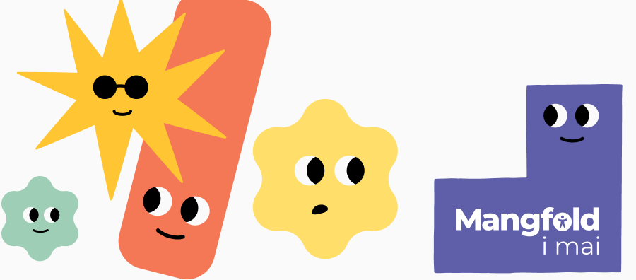

# Mangfold i mai - Global Accessibility Awareness Day Edition

Årets Mangfold i mai byr på en rekke spennende foredrag og workshops på Global Accessibility Awareness Day 15. mai. 

## Ikke noe streaming - men det kommer opptak
Denne gangen har vi dessverre ikke mulighet til å streame live, og dagen kjøres mest lokalt hos oss i Nav. Vi kommer til å legge ut opptak i etterkant der mulig :) 

## Hvorfor er opplegget annerledes i år?
Vi i Nav er midt i en omorgansiering, der vi ser hvordan vi skal rigge oss best mulig for å yte enda bedre service til dere der ute. Arbeidet med universell utforming og mangfold blir en viktig del av dette. Det betyr samtidig at vi i år må bruke en del tid for å få akkurat denne riggen på plass, og har mindre rom for å kjøre en omfattende Mangfold i mai.

## Gikk du glipp av noe i fjor? 
Fortvil ikke. For mange innlegg har vi lagt ut videoopptak. Se [fjorårets program](https://navikt.github.io/mangfold-i-mai/2024/program/).
