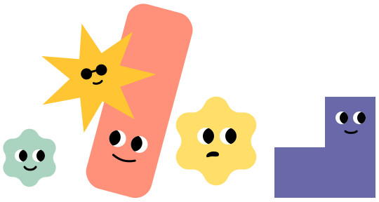

{ class=hero }

# Programmet for årets mangfold i Mai er nesten klart

I år blir alt samlet på én dag med spennende foredrag og workshops. Dagen er Global Accessibility Awareness Day, 15. mai.

## Hvorfor er det bare en dag i år?

Nav holder på å omorganisere seg, og ny organisasjon starter 5.mai. Derfor reduserer vi til kun én dag i år. Vi som jobber med universell utforming og inkluderende design vil bli en del av en ny avdeling for Brukeropplevelse. Arbeidet med universell utforming og mangfold blir en viktig del av denne avdelingen. 


Vi er takknemlig for [tilbakemeldinger på innleggene du har sett](#). Det tar kort tid og hjelper oss masse. Takk!


