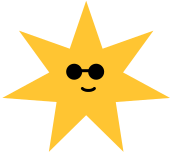

{ class=blob-star }

# Programmet for 2025 er (nesten) klart!

I år arrangeres alle de spennende foredragene og workshoppene den 15. mai, på den internasjonale tilgjengelighetsdagen (Global Accessibility Awareness Day). På grunn av omorganisering av direktoratet, er arrangementene kun for ansatte i Nav.

<a class="pill-delta" href="https://delta.nav.no/mim">
<svg class="icon" width="24" height="24" fill="none" viewBox="0 0 24 24">
  <g stroke="currentColor" stroke-linejoin="round" stroke-width="2">
    <path d="M8 10V7c0-2.5 2-4 4-4s4 1.5 4 4v3"/>
    <path d="M6 20v-9c0-.5.5-1 1-1h10c.5 0 1 .5 1 1v9H6Z"/>
  </g>
  <path stroke="currentColor" stroke-linecap="round" stroke-linejoin="round" stroke-width="1.5" d="M12 16.8v-2.6"/>
  <circle cx="12" cy="14.3" r="1.5" fill="currentColor"/>
</svg>
Program (for ansatte i Nav)
</a>

Vi legger ut [opptak av foredrag](/opptak) i etterkant, der vi har mulighet.


Vi er takknemlig for [tilbakemeldinger på innleggene du har sett](#). Det tar kort tid og hjelper oss masse. Takk!


